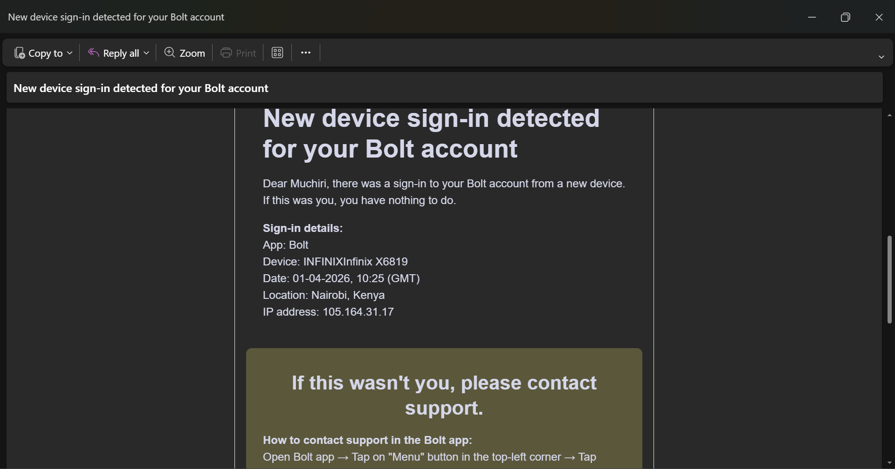

# Security Incident Report

**Incident Type:** Suspicious Account Login Attempt  
**Analyst:** Josphat Muchiri – Candor Labs  
**Report Date:** 02 April 2026  
**Incident Date:** 02 April 2026  

---

## 1. Executive Summary

A login notification was triggered for an account due to access from a new device. The alert was promptly investigated and classified as a **suspicious login attempt with medium risk**. No malicious activity was observed after the login, but the use of an unrecognized device warranted immediate action.

**Overall Risk Level:** Medium

---

## 2. Incident Details

- **Account Affected:** [Redacted / Your Account Name]
- **Alert Triggered:** New device login notification
- **Device:** Infinix X6819 (Android)
- **Location:** Nairobi, Kenya
- **IP Address:** 105.164.31.17
- **Time of Login:** [Add exact timestamp if available]

---

## 3. Initial Assessment

The login raised suspicion because:
- The device (Infinix X6819) was **not previously associated** with the account.
- The login originated from the same city (Nairobi), which could indicate either a legitimate new device or credential theft followed by local access.
- No immediate malicious actions (e.g., transactions, data changes) were observed.

This could represent:
- Legitimate access from a new/secondary device, or
- Credential stuffing / password reuse attack.

---

## 4. Investigation Steps

I performed the following triage steps:

1. Reviewed recent account activity logs for anomalies.
2. Checked the list of registered/known devices associated with the account.
3. Analyzed the source IP address and geolocation data.
4. Verified whether the IP belongs to a known ISP or shows signs of proxy/VPN usage.
5. Searched for any related indicators (password reset attempts, failed logins, etc.).

---

## 5. Findings

- The device **Infinix X6819** was unknown to the account.
- The IP address (105.164.31.17) resolved to a local Kenyan ISP and matched the reported location.
- No unauthorized transactions, data exfiltration, or further malicious activity were detected.
- The login succeeded without triggering additional security controls (e.g., 2FA was not enforced at the time).

**Conclusion:** This was a **suspicious login attempt**, likely due to credential exposure or reuse. It was contained before any damage occurred.

---

## 6. Risk Assessment

| Factor                    | Risk Level | Justification                     |
|---------------------------|------------|-----------------------------------|
| Unknown Device            | Medium     | New device not seen before        |
| Geographic Location       | Low        | Same city as user                 |
| Malicious Post-Login Activity | Low     | No suspicious actions observed    |
| **Overall Risk**          | **Medium** | Potential credential compromise   |

---

## 7. Response Actions Taken

- Immediately changed the account password
- Terminated all active sessions
- Enabled Multi-Factor Authentication (2FA) / Two-Factor Authentication
- Enabled login notifications and activity monitoring
- Reviewed and updated password manager entries for related accounts

---

## 8. Recommendations

**Immediate Actions:**
- Enable 2FA on all critical accounts
- Use a password manager to generate and store unique strong passwords

**Long-term Best Practices:**
- Avoid reusing passwords across multiple services
- Regularly review logged-in devices and active sessions
- Be cautious when logging into accounts on shared or new devices
- Monitor login alerts and act quickly on suspicious notifications

---

## 9. Lessons Learned

This incident demonstrates the value of:
- Real-time login notifications
- Rapid response to security alerts
- Strong authentication controls (especially 2FA)

It also reinforces why credential hygiene and device management are critical in daily security operations.

---

**Status:** Incident Resolved  
**Analyst Signature:** Josphat Muchiri
