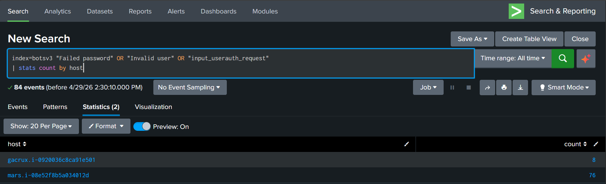
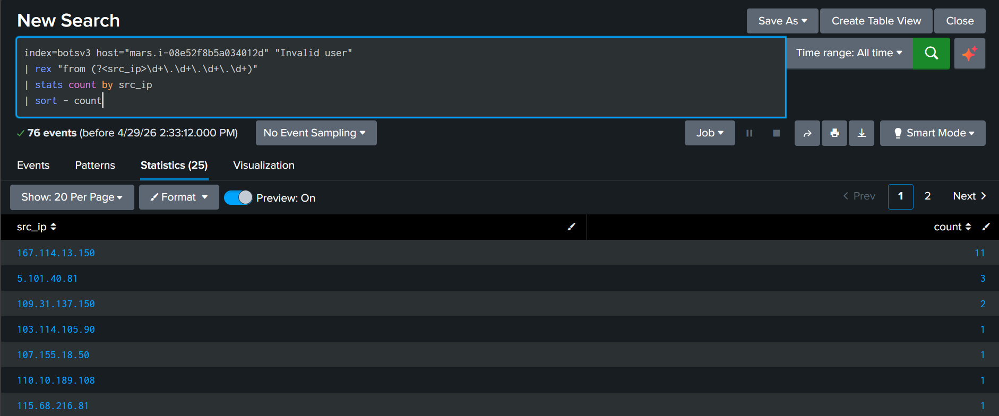
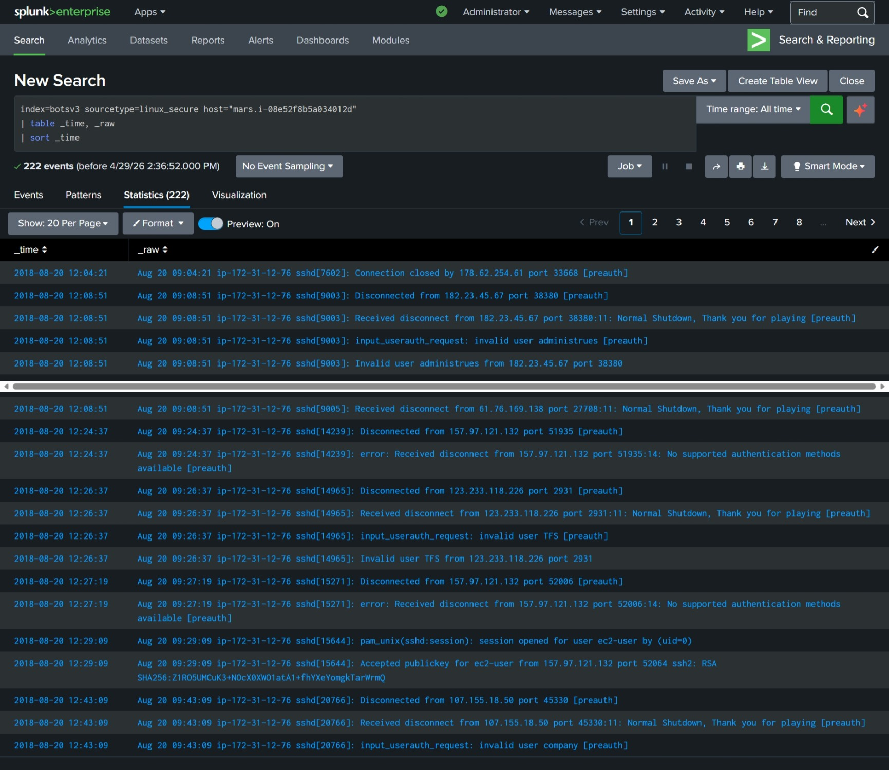
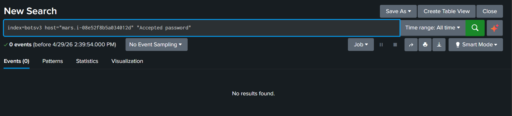
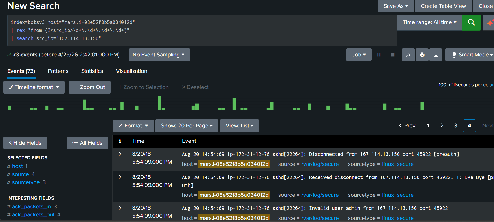

# SSH Brute-Force Attack Investigation (Splunk BOTS v3)

## Overview
This investigation analyzes SSH authentication activity in the Splunk BOTS v3 dataset to identify brute-force attempts and determine whether the target host was compromised.

---

## Objective
- Identify brute-force login behavior  
- Determine attacking source IP(s)  
- Assess whether compromise occurred  

---

## Initial Scoping

To identify hosts generating authentication failures:

```spl
index=botsv3 "Failed password" OR "Invalid user" OR "input_userauth_request"
| stats count by host
```

### Results

- mars.i-08e52f8b5a034012d → 76 events  
- gacrux.i-0920036c8ca91e501 → 8 events  



Focus was placed on **mars** due to the higher volume of authentication failures.

---

## Field Extraction

SSH logs did not contain a parsed `src_ip` field, so it was extracted using regex:

```spl
index=botsv3 host="mars.i-08e52f8b5a034012d" "Invalid user"
| rex "from (?<src_ip>\d+\.\d+\.\d+\.\d+)"
| stats count by src_ip
| sort - count
```

### Results



---

## Key Findings

### Suspicious Source IP

- 167.114.13.150 → 11 failed login attempts within ~1 minute  

### Behavior Observed

- Rapid authentication attempts  
- Multiple usernames targeted:
  - admin  
  - pi  
  - support  
  - usuario  
  - user  
  - ubnt  
  - test  

This behavior is consistent with automated brute-force or credential-guessing activity.

---

## Timeline Analysis

```spl
index=botsv3 sourcetype=linux_secure host="mars.i-08e52f8b5a034012d"
| table _time, _raw
| sort _time
```

### Results



### Observations

- Multiple login attempts within seconds  
- Same source IP across all attempts  
- Different usernames used per attempt  

This pattern indicates dictionary-based brute-force activity.

---

## Compromise Assessment

### Step 1: Search for Successful Authentication

```spl
index=botsv3 host="mars.i-08e52f8b5a034012d" "Accepted password"
```

### Results



No successful authentication events were identified.

---

### Step 2: Review All Activity from Suspicious IP

```spl
index=botsv3 host="mars.i-08e52f8b5a034012d"
| rex "from (?<src_ip>\d+\.\d+\.\d+\.\d+)"
| search src_ip="167.114.13.150"
```

### Results



Only failed authentication attempts were observed. No evidence of successful login or persistence was found.

---

## Analysis

- Activity matches automated SSH brute-force behavior  
- Use of common/default usernames indicates opportunistic scanning  
- No indicators of successful authentication or system compromise  

---

## Conclusion

The activity against mars.i-08e52f8b5a034012d is consistent with a brute-force SSH attack originating from 167.114.13.150.

Despite multiple rapid login attempts, there is no evidence of successful compromise based on the available logs.

---

## Recommendations

- Block traffic from 167.114.13.150  
- Configure SIEM alerts for repeated SSH login failures  
- Enforce key-based SSH authentication  
- Implement multi-factor authentication (MFA)  
- Disable or monitor common/default usernames  

---

## Skills Demonstrated

- SIEM investigation (Splunk)  
- Log analysis and correlation  
- Field extraction using regex  
- Threat detection and validation  
- Evidence-based decision making  
