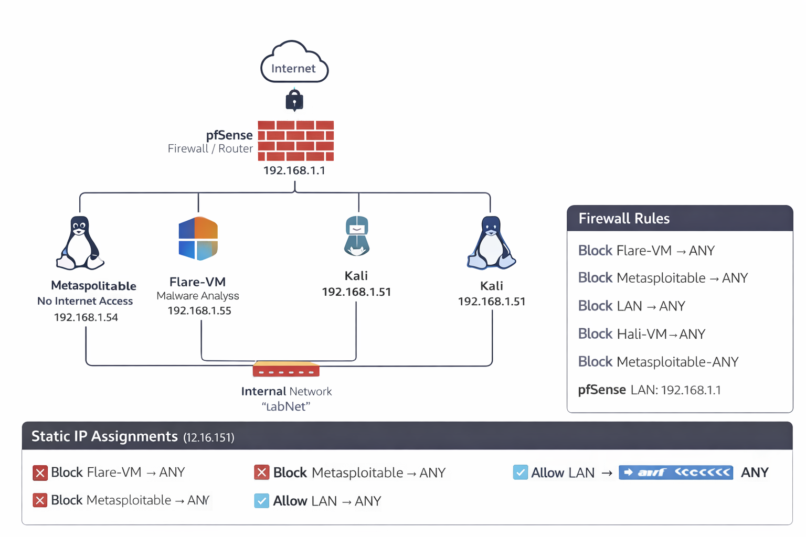

# SOC Lab Network Topology

**Part of Candor Labs** | Ongoing Project

I designed and built this isolated SOC lab to create a realistic and safe environment for practicing security operations, detection engineering, and incident response.

## Lab Architecture

## Key Design Decisions

- **pfSense Firewall** (192.168.1.1) — Central gateway with strict egress control
- **Network Segmentation** — Dedicated LabNet (192.168.1.0/24)
- **High-risk VM Isolation** — Blocked outbound internet from Metasploitable and Flare-VM
- **Controlled Traffic** — Only necessary log collection, DNS, and internal communication allowed
- **Static IP Planning** — Clean, documented addressing scheme

## Lab Components

| Component            | IP Address      | Purpose                              |
|----------------------|-----------------|--------------------------------------|
| pfSense              | 192.168.1.1    | Firewall & Router                    |
| Wazuh Manager        | 192.168.1.52   | Central SIEM & Log Management        |
| AD Domain Controller | 192.168.1.53   | Enterprise simulation                |
| Kali Linux           | 192.168.1.51   | Attack simulation                    |
| Flare-VM             | 192.168.1.55   | Malware analysis (isolated)          |
| Metasploitable       | 192.168.1.54   | Vulnerable target (isolated)         |

## Challenges & Solutions

| Challenge                                      | Solution Implemented                              |
|------------------------------------------------|---------------------------------------------------|
| High-risk VMs could reach the internet         | Strict pfSense egress rules to block outbound     |
| Wazuh agents not sending logs across firewall  | Specific allow rules for log collection traffic   |
| AD DNS traffic being blocked                   | Targeted DNS allow rules                          |
| IP management during testing                   | Static IP assignments with full documentation     |

This lab serves as the solid networking foundation for all my detection, SIEM, and automation work in Candor Labs.
